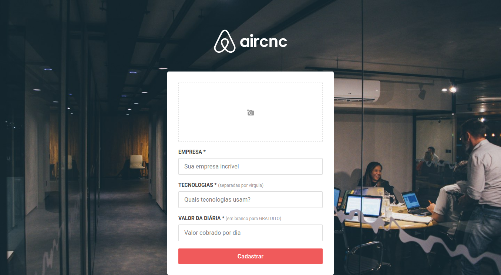
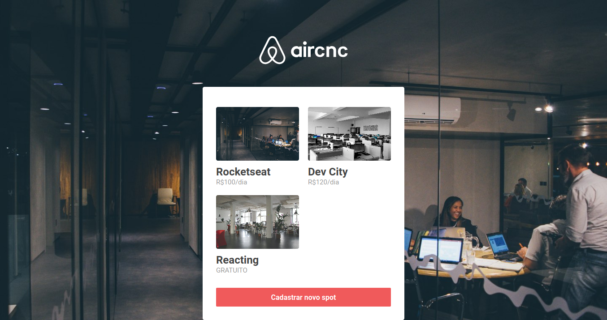
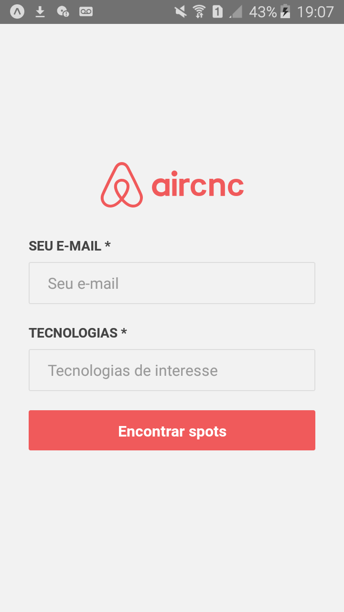
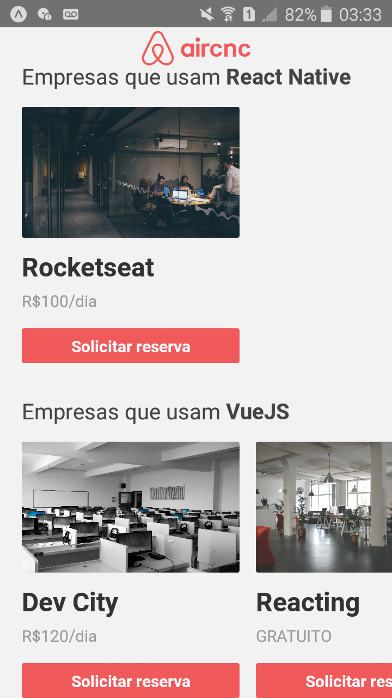

# Omnistack 9
 Aplicação desenvolvida seguindo o evento semana Omnistack 9 da Rockseat com foco no uso das tecnologias: Node.js, ReactJS e React Native.
 O Aircnc é um projeto que visa conectar empresas que querem abrir spots e desenvolvedores que procuram um lugar para trocar ideias com devs, conhecer a empresa e trabalhar lá por um período.

  

  

  

  
  
  

# Funcionalidades
 - Cadastro de spots em banco de dados não relacional
 - Listagem de spots por tecnologia
 - Notificação de reservas em tempo real

# Principais Tecnologias
 - Node.js
 - ReactJS
 - React Native
 - Expo
 - Socket.io
